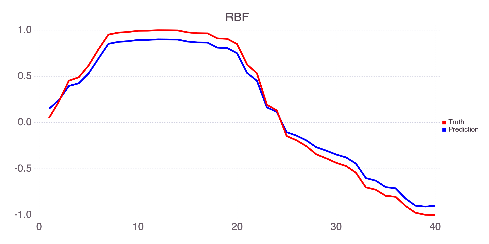
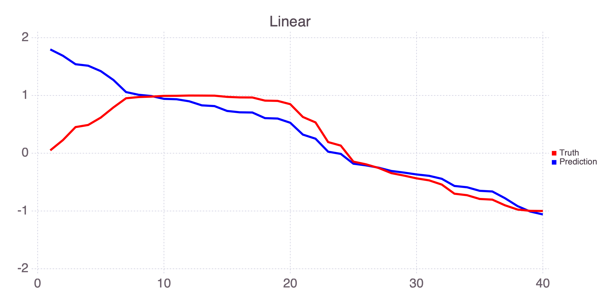
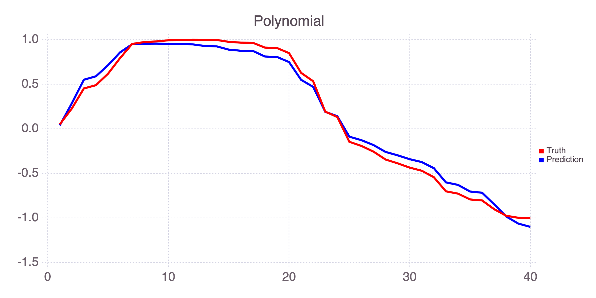

SVR
================

Support Vector Regression (SVR) analysis in [Julia](http://julialang.org) utilizing the [libSVM](https://www.csie.ntu.edu.tw/~cjlin/libsvm/) library.

SVR is a module of [MADS](http://madsjulia.github.io/Mads.jl) (Model Analysis & Decision Support).

Installation
------------

```julia
import Pkg; Pkg.add("SVR")
```

Examples
-------

Matching sine function:

```julia
import SVR
import Mads

X = sort(rand(40) * 5)
y = sin.(X)
```

Predict `y` based on `X` using `RBF`

```
Mads.plotseries([y SVR.fit(y, permutedims(X); kernel_type=SVR.RBF)], "figures/rbf.png"; title="RBF", names=["Truth", "Prediction"])
```

<div style="text-align: left">
    
</div>

Predict `y` based on `X` using `LINEAR`

```
Mads.plotseries([y SVR.fit(y, permutedims(X); kernel_type=SVR.LINEAR)], "figures/linear.png"; title="Linear", names=["Truth", "Prediction"])

```

<div style="text-align: left">
    
</div>

Predict `y` based on `X` using `POLY`

```
Mads.plotseries([y SVR.fit(y, permutedims(X); kernel_type=SVR.POLY, coef0=1.)], "figures/poly.png"; title="Polynomial", names=["Truth", "Prediction"])
```

<div style="text-align: left">
    
</div>

libSVM test example:

```julia
import SVR

x, y = SVR.readlibsvmfile(joinpath(dirname(pathof(SVR)), "..", "test", "mg.libsvm")) # read a libSVM input file

pmodel = SVR.train(y, permutedims(x)) # train a libSVM model

y_pr = SVR.predict(pmodel, permutedims(x)); # predict based on the libSVM model

SVR.savemodel(pmodel, "mg.model") # save the libSVM model

SVR.freemodel(pmodel) # free the memory allocation of the libSVM model
```

Projects using SVR
-----------------

* [MADS](https://github.com/madsjulia)
* [SmartTensors](https://github.com/SmartTensors)
* [SmartML](https://github.com/SmartTensors/SmartML.jl)

Publications, Presentations, Projects
--------------------------

* [mads.gitlab.io](http://mads.gitlab.io)
* [madsjulia.github.io](https://madsjulia.github.io)
* [SmartTensors](https://SmartTensors.github.io)
* [monty.gitlab.io](http://monty.gitlab.io)
* [montyv.github.io](https://montyv.github.io)
